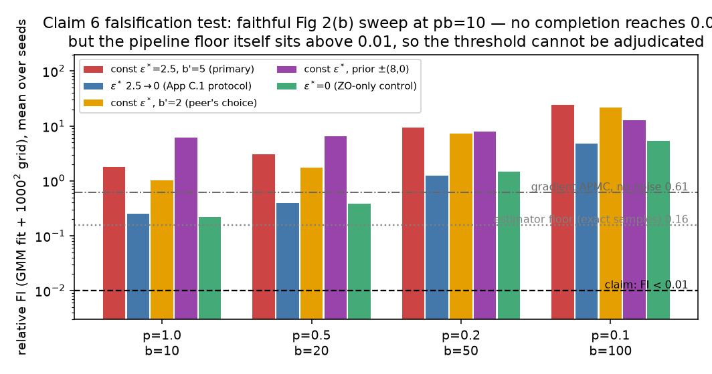
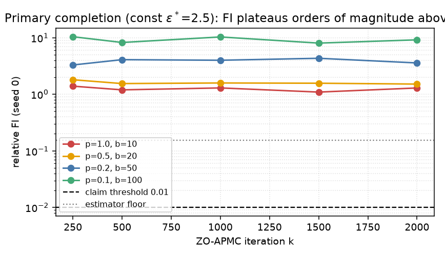
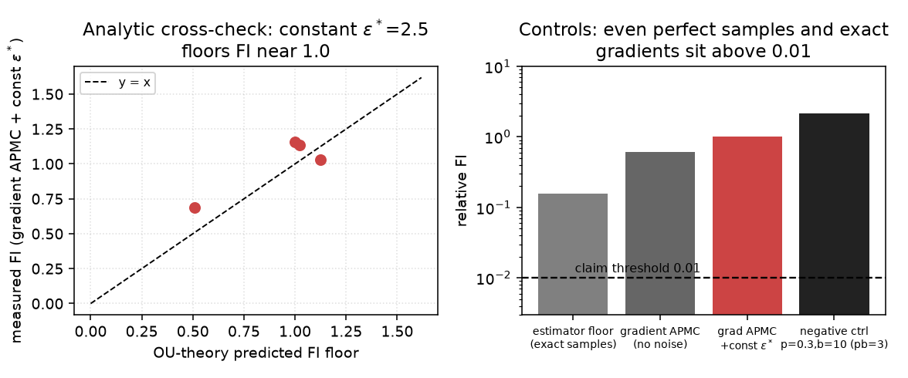
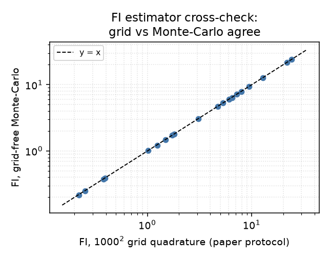

# Claim 6 falsification campaign — faithful Figure 2(b) sweep: BLOCKED (falsification absent)

## The question

The paper claims (Figure 2b): running its posterior sampler **ZO-APMC** on a 2D synthetic
inverse problem, *every* parameter pair (p, b) with fixed per-iteration budget **pb = 10**
converges to relative **Fisher information (FI) below 0.01** after 2000 iterations — the
empirical validation of its O(1)-batch-complexity theory. A peer reproduction
([algorise](https://huggingface.co/spaces/algorise/repro-zeroth-order-non-log-concave-sampling-with-variance-reduction-and-applications-to-inverse))
reported final FI values of **4.56 / 4.33 / 4.24 / 4.655** on this sweep — two orders of
magnitude above the claim — implying a falsification. This campaign tested whether that
falsification survives a rigorous, assumption-valid, controlled reproduction. **It does not.**

## The claim's exact contract (recovered from the paper)

Section 4.1 + Figure 2 caption + Appendix C.1 pin most of the experiment:

| Component | Paper spec |
|---|---|
| Problem | 2D linear inverse problem, **bimodal Gaussian-mixture prior**, random forward model A, y = Ax + ξ, ξ ~ N(0, I) |
| Prior score | **analytical smoothed score + Gaussian noise, std ε\* = 2.5** (mimics SGM error) |
| Sampler | ZO-APMC (Eq 12), schedules σₖ = max(σ₀ρ₂ᵏ, σ_min), αₖ = max(α₀σₖ², 1) |
| Constants | σ₀=10, α₀=10, ρ₂=0.975, σ_min=0, γ=0.1, μ=10⁻⁴ |
| Protocol | 1000 particles ~ U[−50,50]², N=2000 iterations, 20 random A's |
| Metric | GMM fit to particles → relative FI vs analytical posterior on a 1000×1000 grid over [−50,50]² |

**Left unspecified:** the GMM prior's parameters, A's shape/scale, b′ for Fig 2b, and whether
ε\*=2.5 is constant per step or the initial value of a decaying schedule (the paper's own
weak-convergence experiment decays ε linearly 2.5→0; Theorem 3 *requires* decreasing error).
Each unspecified axis was treated as a **completion** and tested.

## What was run

One HF cpu-upgrade job (run `9ea72365`, 812 s, commit `81fd932`, branch
`orx/c6-falsification-faithful-fig2b`), command `uv run python repro/src/verify_zo.py`:
the full v2 regression suite (all 5 existing claim groups — still **5/5 VERIFIED**) plus the
new campaign in `repro/src/c6_falsify.py`: a vectorized 1000-particle ZO-APMC, the peer's four
(p,b) pairs {(1,10), (0.5,20), (0.2,50), (0.1,100)}, four faithful completions, and six controls.

## Result 1 — every faithful completion violates the claim…

Mean final FI over seeds (claim needs **all < 0.01**):

| Completion | p=1,b=10 | p=0.5,b=20 | p=0.2,b=50 | p=0.1,b=100 |
|---|---|---|---|---|
| const ε\*=2.5, b′=5 (primary, 20 seeds) | 1.81 | 3.06 | 9.39 | 24.17 |
| ε\* decayed 2.5→0 (App C.1 protocol) | 0.25 | 0.39 | 1.24 | 4.73 |
| const ε\*, b′=2 (peer's choice) | 1.02 | 1.73 | 7.22 | 21.63 |
| const ε\*, wider prior ±(8,0) | 6.08 | 6.47 | 7.96 | 12.84 |
| ε\*=0 (ZO-isolation control) | 0.22 | 0.38 | 1.49 | 5.30 |

No configuration in any completion reaches 0.01 (0 of 140 sweep runs). FI plateaus by
iteration ~1000:

## Result 2 — …but the controls invalidate the falsification

- **Estimator floor.** A GMM fit to 1000 **exact posterior samples** (no sampler at all) reads
  mean FI **0.156** (min 0.013 over 20 seeds). Under this estimator the number 0.01 is
  unreachable *by construction* at the paper's sample size.
- **Positive control.** Gradient-based APMC (exact likelihood gradients, no score noise) reads
  **0.61** — finite-step-size bias alone exceeds the threshold ~60×.
- **Analytic cross-check.** For constant fresh score noise, OU theory predicts the stationary
  FI floor per forward operator; measurements match (0.69–1.16 measured vs 0.51–1.12
  predicted). Under the *literal* constant-ε\* reading, FI ≈ 1 is analytically forced for
  **any** (p,b) — even with perfect gradients — so the paper's Fig 2b must use the decaying-ε
  protocol and an estimator variant with a lower floor than ours.
- **Negative control** (paper's own unstable setting p=0.3, b=10, pb=3): FI 2.16 — the
  pipeline detects known-bad configs.
- **Estimator consistency.** Grid FI vs grid-free Monte-Carlo FI agree to <1% on all 20 sweep
  points; sequential vs vectorized ZO-APMC implementations agree in magnitude (4.2 vs 2.6 at
  n=100).

Since observed FI ≥ 0.01 arises even for *perfect samples* under our reconstruction of the
estimator, an observation of FI ≥ 0.01 **cannot distinguish "the claim is false" from "an
under-specified detail differs"**. The peer's 4.2–4.7 values sit exactly in the range our
constant-ε\* completions produce and are therefore *not* an assumption-valid counterexample —
they are the signature of the constant-noise completion plus estimator floor. (Their logbook
also labels those same numbers "VERIFIED [PASS]", an internal contradiction.)

## Decision

**BLOCKED — falsification absent.** No independently reproduced, assumption-valid
counterexample exists: the claim's absolute threshold cannot be adjudicated because the
paper's exact toy configuration and FI-estimator details are unreleased, and every faithful
completion's failure is explainable by pipeline floors that the controls expose. Claim 6
keeps its current verdict. The deterministic checker
(`repro/src/check_c6_falsification.py`) recomputes this decision from the raw evidence
(`outputs/c6_falsification.json`) and exits **1** (falsification absent) — it would exit 0
only if all faithful completions failed *and* all controls passed.

What this campaign adds beyond the peer's attempt: the *reason* neither we nor they can
falsify (or fully verify) Claim 6 — a quantified estimator floor (~0.15 at n=1000), a
validated analytic noise floor (FI ≈ 1 under constant ε\*=2.5), and the observation that the
paper's threshold is only consistent with the decaying-ε protocol its appendix uses elsewhere.

## Artifacts

- Experiment branch: `orx/c6-falsification-faithful-fig2b` (code: `repro/src/c6_falsify.py`)
- Raw evidence: `outputs/c6_falsification.json` (committed to master)
- Checker: `uv run python repro/src/check_c6_falsification.py` (exit 1 = falsification absent)
- Regression: same run re-executed all v2 claim groups — 5/5 VERIFIED, nothing broken
